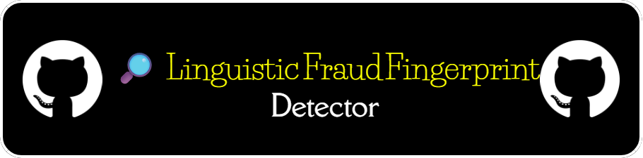
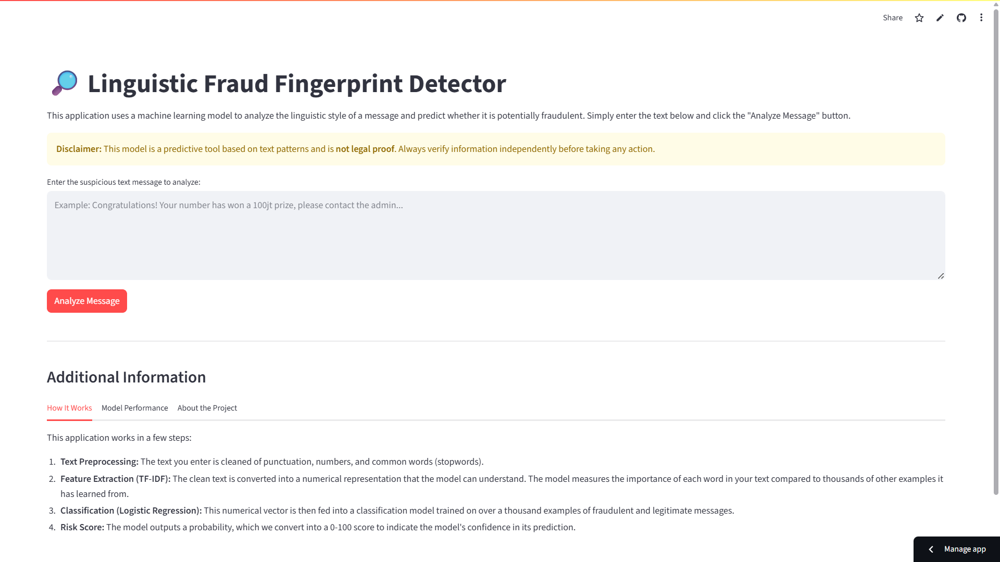

An application powered by a machine learning model to detect potential fraud in Indonesian text messages based on their linguistic patterns and style. This project showcases an end-to-end data science workflow, from critical data sourcing to interactive deployment.

**[➡️ Try the Live Demo Here!](https://innovation-frontier-fraud-detection.streamlit.app/)**

---

## 🎯 The Problem: The Evolving Nature of Digital Fraud

Digital fraud in Indonesia has moved beyond simple keyword-based scams. Modern fraudulent messages employ sophisticated psychological and narrative tactics to manipulate victims, making traditional detection methods based on words like "hadiah" or "transfer" obsolete. These new variants often mimic legitimate transactional or promotional messages, creating a significant challenge for automated detection.

This project tackles this problem by building a model that learns the **"linguistic fingerprint"** of a scam, focusing on style, structure, and persuasive patterns rather than just keywords.

## 🔬 Methodology: From Messy Data to Actionable Insights

This project demonstrates a complete data science lifecycle, emphasizing critical thinking in a low-resource, high-impact environment.

### 1. Data Collection & Curation: A Note on Real-World Data Challenges

The quality of any machine learning model is determined by the quality of its training data. A significant portion of this project was dedicated to curating a high-quality dataset. However, a key finding of this work is the **profound difficulty in sourcing sufficient public data for this specific problem.**

**Phase 1: Sourcing Fraudulent Samples (Label 1)**
-   **Objective:** To capture a wide variety of real-world scam narratives.
-   **Process:** A systematic data sourcing strategy was employed, combining targeted web scraping with human-in-the-loop verification. Samples were curated and anonymized from public Indonesian online sources, including community forums (**Kaskus**, **Reddit**), news comment sections, and crowdsourced platforms (**Kredibel.co.id**).

**Phase 2: Curating Legitimate Samples (Label 0 - The Critical Step)**
-   **Objective:** To create a challenging dataset by using "hard negatives"—legitimate messages that share characteristics with scams.
-   **Process:** A targeted collection process was used to source and anonymize legitimate transactional and promotional messages from banks, e-commerce platforms, and official job portals.

**The Insufficiency Bottleneck:**
> While this curation strategy was rigorous, the resulting dataset, though balanced, was **ultimately insufficient in scale and variety** to build a truly generalizable, production-ready model. This limitation is not a failure of the process, but a core finding of the project itself: it highlights the significant bottleneck of data scarcity when tackling niche, real-world problems in the absence of large, pre-labeled public datasets.

### 2. Preprocessing & Feature Engineering
-   **Text Cleaning:** A standard pipeline was applied: lowercasing, removing URLs, punctuation, numbers, and custom Indonesian stopwords.
-   **Feature Extraction:** `TfidfVectorizer` was used to convert the cleaned text into a numerical representation. N-grams of (1,2) were included to capture common two-word phrases.

### 3. Modeling & Evaluation
-   **Model Choice:** A `Logistic Regression` model was chosen as a strong, interpretable baseline. `class_weight='balanced'` was used to handle any potential class imbalance.
-   **Evaluation Metrics:** The model's performance was evaluated not on simple accuracy, but on metrics crucial for fraud detection, primarily **F1-Score, Recall, and Precision**.

### 4. Deployment
The trained model and TF-IDF vectorizer were saved using `joblib` and wrapped into an interactive web application using **Streamlit**. This allows for easy, real-time inference without needing to run code notebooks.

## 📈 Model Performance & Interpretation: A Note on "Perfection"

The model was evaluated on a held-out test set and achieved a perfect score across all key metrics:

-   **F1-Score (Fraud Class):** **1.00**
-   **Recall (Fraud Class):** **1.00**
-   **Precision (Fraud Class):** **1.00**

**It is crucial to interpret this perfect result with a critical, real-world perspective.**

A score of 1.00 does not imply the model is infallible. Instead, it strongly indicates that the **underlying dataset, due to the significant challenges in sourcing diverse public data, lacks the complexity and variety needed to truly challenge the model.**

-   **What this score means:** The model has successfully memorized the clear linguistic patterns present within the limited and somewhat repetitive samples in our curated dataset. It proves that a clear distinction exists between the two classes *within our data*.
-   **What this score does NOT mean:** It does not guarantee the same performance on new, unseen scam variants in the wild. A perfect score in this context is more a reflection of a "solved" dataset than a universally perfect model. This outcome underscores the project's main finding: the most significant hurdle in real-world data science is often data scarcity and variety, not model tuning.
## 🛠️ Tech Stack

-   **Language:** Python 3.11+
-   **Analysis & ML:** Pandas, Scikit-learn, NLTK, Joblib
-   **Visualization:** Matplotlib, Seaborn, WordCloud
-   **Web App:** Streamlit
-   **Development:** Jupyter Notebook (via VS Code on a remote VPS)

## 👤 Creator

This project was designed and developed by:

**Rafif Sudanta**
- **Email:** [rafifsudanta1@gmail.com](mailto:rafifsudanta1@gmail.com)
- **LinkedIn:** [linkedin.com/in/rafif-sudanta](https://www.linkedin.com/in/rafif-sudanta/)
- **GitHub:** [@r1afif18](https://github.com/r1afif18)

## 📄 License

This project is released under the **MIT License**.
